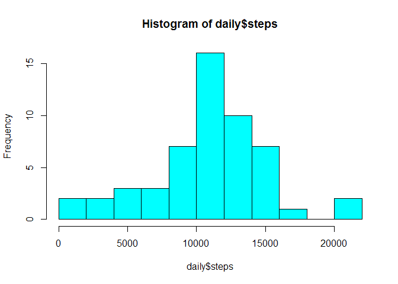
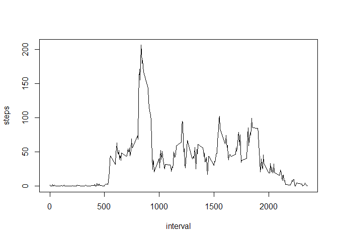
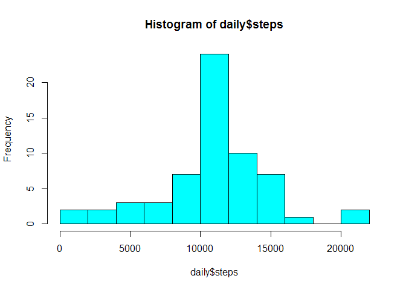
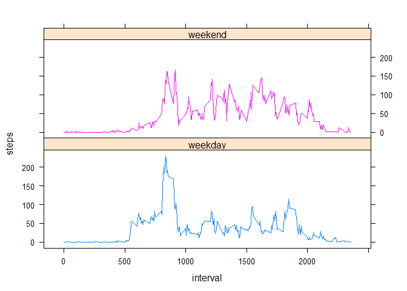

# Reproducible Research: Peer Assessment 1


## Loading and preprocessing the data


```r
activity <- read.csv(unz("activity.zip", "activity.csv"), na.strings = "NA")
```


## What is mean total number of steps taken per day?


```r
library(stats)  # for aggregate()
daily_analysis <- function(activity) {
  daily <- aggregate(activity$steps, by = list(activity$date), FUN = sum)
  colnames(daily) <- c("date", "steps")
  
  hist(daily$steps, breaks = 10, col = "cyan")
  
  cat("Daily mean:", mean(daily$steps, na.rm = T),
      "\nDaily median:", median(daily$steps, na.rm = T))
}
daily_analysis(activity)
```

 

```
## Daily mean: 10766.19 
## Daily median: 10765
```


## What is the average daily activity pattern?


```r
intervals <- aggregate(activity$steps, by = list(activity$interval), FUN = mean, na.rm = T)
colnames(intervals) <- c("interval", "steps")

plot(intervals, type = 'l')
```

 

```r
# which interval has max steps, on average?
intervals[which.max(intervals$steps),]
```

```
##     interval    steps
## 104      835 206.1698
```


## Imputing missing values


```r
# how many missing step values? (Note: no missing date or interval values!)
sum(is.na(activity$steps))
```

```
## [1] 2304
```

```r
# how are they distributed?
t <- aggregate(activity$steps, by = list(activity$date), FUN = function(x) {sum(is.na(x))})
t[t$x > 0,]
```

```
##       Group.1   x
## 1  2012-10-01 288
## 8  2012-10-08 288
## 32 2012-11-01 288
## 35 2012-11-04 288
## 40 2012-11-09 288
## 41 2012-11-10 288
## 45 2012-11-14 288
## 61 2012-11-30 288
```

```r
rm(t)

# it seems that only entire days are missing.
# fill each missing interval with that interval's daily average:
activity.filled <- activity
activity.filled$steps[is.na(activity$steps)] <- as.integer(intervals$steps)

daily_analysis(activity.filled)
```

 

```
## Daily mean: 10749.77 
## Daily median: 10641
```

```r
# Note: imputing missing values changes (lowers) the mean and median of daily steps.
```


## Are there differences in activity patterns between weekdays and weekends?


```r
activity.filled$day_type <- 
  as.factor(ifelse(weekdays(as.Date(activity.filled$date), T) %in% c("Sat", "Sun"), 
                   "weekend", "weekday"))
intervals <- aggregate(activity.filled$steps, 
                       by = list(activity.filled$interval, activity.filled$day_type), 
                       FUN = mean)
colnames(intervals) <- c("interval", "day_type", "steps")

# par(mfcol = c(2, 1))
# plot(steps ~ interval, intervals[intervals$day_type == "weekday",], type = 'l', col = "blue")
# plot(steps ~ interval, intervals[intervals$day_type == "weekend",], type = 'l', col = "red")

library(lattice)
xyplot(steps ~ interval | day_type, intervals, type = 'l', groups = day_type, layout = c(1, 2))
```

 
